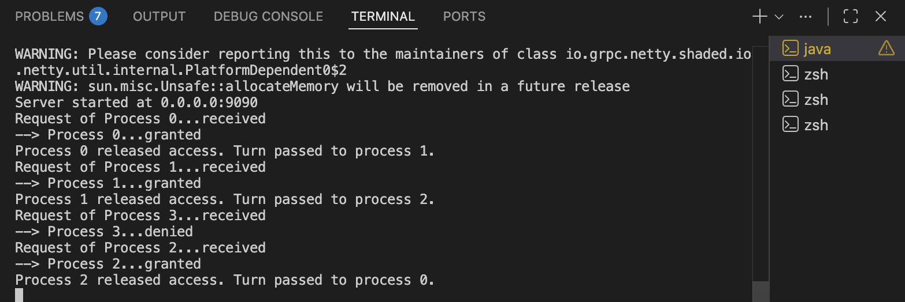

# Alternated Mutex - TP 2 Distributed Systems 

## Overview

This project implements an Alternated Mutex algorithm for distributed systems using gRPC and Protocol Buffers.

The goal is to ensure mutual exclusion when multiple processes access a shared resource. The algorithm follows a round-robin strategy, allowing processes to enter the critical section one at a time in a fair and ordered manner, thus preventing conflicts and starvation.

## Demo

---

**Course**: Systèmes Répartis (Distributed Systems)  
**Assignment**: TP2 - Alternated Mutex Implementation  
**Done by**: Sahar Khemiri and Bochra Karoui